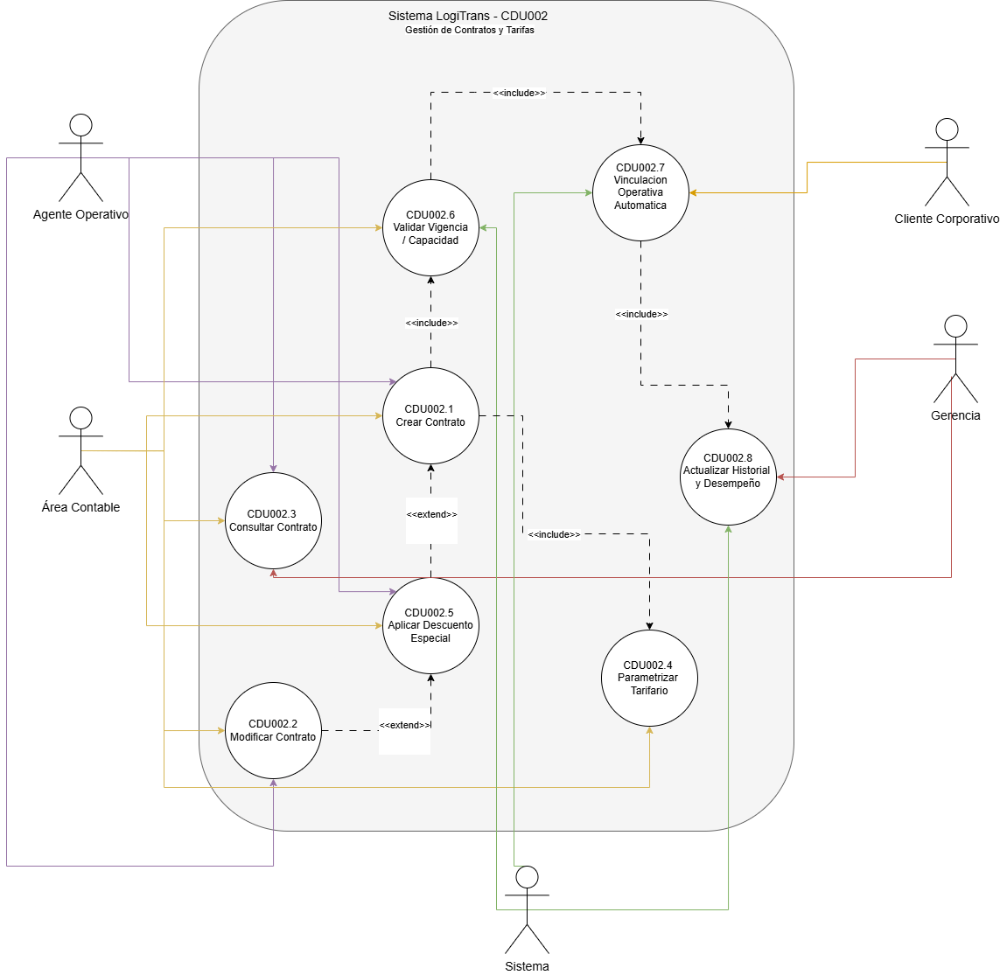

# 1. Descripción de actores de Gestión de Clientes y Contratos
](../images/CDU1/actores.png)

-------------------------------------------------------------------
# Caso de Uso de Alto Nivel

-------------------------------------------------------------------
# Primera Descomposición
## Procesos Críticos Generales

- **CDU001** – Gestión de Clientes
- **CDU002** – Gestión de Contratos y Tarifas

> **Nota:** Los procesos de Validación Financiera, Vinculación Operativa e Historial y Desempeño se modelan como casos de uso expandidos dentro de CDU002, ya que forman parte del ciclo de vida de un contrato y no constituyen procesos críticos independientes en la primera descomposición.

-------------------------------------------------------------------

# Casos Expandidos

## CDU001 – Gestión de Clientes

- CDU001.1 – Registrar Cliente
- CDU001.2 – Consultar Cliente
- CDU001.3 – Modificar Cliente
- CDU001.4 – Gestionar Credenciales
- CDU001.5 – Bloquear / Desactivar Cliente

-------------------------------------------------------------------
## Diagrama de expandidos para el CDU001

> Este diagrama muestra todos los casos de uso expandidos del CDU001 con sus relaciones:
> - **Agente Operativo** interactúa con: CDU001.1, CDU001.2, CDU001.3, CDU001.4
> - **Cliente Corporativo** interactúa con: CDU001.2, CDU001.4
> - **Área Contable** interactúa con: CDU001.2, CDU001.5
> - **Gerencia** interactúa con: CDU001.2
> - **Sistema** interactúa con: CDU001.5
> - CDU001.1 `<<extend>>` → CDU001.4 Gestionar Credenciales
> - CDU001.2 `<<extend>>` → CDU001.3 Modificar Cliente
> - CDU001.2 `<<extend>>` → CDU001.5 Bloquear/Desactivar Cliente

-------------------------------------------------------------------
## CDU001.1 – Registrar Cliente

| Campo                 | Detalle |
| --------------------- | ------- |
| **Nombre**            | Registrar Cliente |
| **Código**            | CDU001.1 |
| **Actores**           | Agente Operativo |
| **Descripción**       | Permite registrar en el sistema los datos fiscales, contactos clave y categoría de riesgo de un cliente corporativo (importadora, exportadora o comercio). Este registro centralizado elimina la necesidad de consultar múltiples hojas de cálculo y garantiza que todos los departamentos accedan a la misma información actualizada. |
| **Precondiciones**    | El cliente no debe estar previamente registrado en el sistema. El Agente Operativo debe haber iniciado sesión. |
| **Postcondiciones**   | Cliente registrado correctamente en el sistema, o proceso cancelado sin modificaciones. |
| **Flujo Principal**   | 1. El Agente Operativo accede al módulo de registro de clientes. 2. Ingresa el NIT y razón social del cliente. 3. Registra los contactos clave del cliente. 4. Asigna la categoría de riesgo (capacidad de pago, riesgo de mercancía, riesgo en aduanas, lavado de dinero). 5. El sistema valida que todos los campos obligatorios estén completos. 6. El Agente Operativo confirma el registro presionando "Guardar". 7. El sistema almacena los datos y muestra confirmación de registro exitoso. |
| **Flujos Alternos**   | **FA1:** El Agente Operativo no ingresa el NIT. FA1.1 El sistema muestra notificación de campo obligatorio. FA1.2 El Agente Operativo ingresa el NIT. FA1.3 Se continúa con el flujo principal (3).  **FA2:** El NIT ingresado ya existe en el sistema. FA2.1 El sistema muestra mensaje: "El NIT ya se encuentra registrado". FA2.2 El Agente Operativo verifica el NIT ingresado. FA2.3 El Agente Operativo corrige el NIT o cancela el proceso. FA2.4 Si corrige, se continúa con el flujo principal (3).  **FA3:** La categoría de riesgo no fue asignada. FA3.1 El sistema muestra notificación de campo obligatorio. FA3.2 El Agente Operativo selecciona la categoría de riesgo correspondiente. FA3.3 Se continúa con el flujo principal (5). |
| **Reglas de Negocio** | El NIT debe ser único y válido dentro del sistema. La categoría de riesgo es un campo obligatorio para completar el registro. |
| **Reglas de Calidad** | El sistema debe validar los campos en tiempo real conforme el usuario los ingresa. El tiempo de respuesta al guardar no debe exceder 3 segundos. |

-------------------------------------------------------------------
## CDU001.2 – Consultar Cliente

| Campo                 | Detalle |
| --------------------- | ------- |
| **Nombre**            | Consultar Cliente |
| **Código**            | CDU001.2 |
| **Actores**           | Agente Operativo, Cliente Corporativo, Área Contable, Gerencia |
| **Descripción**       | Permite visualizar la información registrada de un cliente corporativo, incluyendo sus datos fiscales, contactos clave, categoría de riesgo y estado de cuenta. Cada actor puede acceder únicamente a la información que su rol le permite visualizar dentro de la plataforma. |
| **Precondiciones**    | El cliente debe estar previamente registrado en el sistema. El actor debe haber iniciado sesión con credenciales válidas. |
| **Postcondiciones**   | Información del cliente mostrada correctamente al actor solicitante. |
| **Flujo Principal**   | 1. El actor accede al módulo de consulta de clientes. 2. Ingresa el criterio de búsqueda (NIT, razón social u otro). 3. El sistema realiza la consulta en la base de datos. 4. El sistema muestra la información del cliente según los permisos del actor. 5. El actor visualiza la información y finaliza la consulta. |
| **Flujos Alternos**   | **FA1:** El cliente no es encontrado con el criterio ingresado. FA1.1 El sistema muestra el mensaje: "No se encontraron resultados". FA1.2 El actor verifica y corrige el criterio de búsqueda. FA1.3 Se continúa con el flujo principal (3).  **FA2:** El actor no tiene permisos para visualizar la información solicitada. FA2.1 El sistema muestra mensaje: "Acceso denegado. Permisos insuficientes". FA2.2 El actor cierra el mensaje y regresa al menú principal. |
| **Reglas de Negocio** | Solo usuarios autorizados y con el rol correspondiente pueden consultar la información del cliente. La información financiera solo puede ser visualizada por el Área Contable y Gerencia. |
| **Reglas de Calidad** | El tiempo de respuesta de la consulta no debe exceder 2 segundos. Todo acceso a información de clientes debe quedar registrado en la bitácora de auditoría. |

-------------------------------------------------------------------
## CDU001.3 – Modificar Cliente

| Campo                 | Detalle |
| --------------------- | ------- |
| **Nombre**            | Modificar Cliente |
| **Código**            | CDU001.3 |
| **Actores**           | Agente Operativo |
| **Descripción**       | Permite actualizar los datos fiscales, contactos clave o categoría de riesgo de un cliente corporativo previamente registrado en el sistema, garantizando que la información se mantenga vigente y correcta para todos los departamentos. |
| **Precondiciones**    | El cliente debe estar registrado en el sistema. El Agente Operativo debe haber iniciado sesión. |
| **Postcondiciones**   | Información del cliente actualizada correctamente, o proceso cancelado sin cambios. |
| **Flujo Principal**   | 1. El Agente Operativo consulta al cliente (CDU001.2). 2. Selecciona la opción "Editar" sobre el registro del cliente. 3. Modifica los campos necesarios (datos fiscales, contactos o categoría de riesgo). 4. El sistema valida los cambios ingresados. 5. El Agente Operativo confirma los cambios presionando "Guardar". 6. El sistema almacena las modificaciones y registra el evento en auditoría. 7. El sistema muestra confirmación de actualización exitosa. |
| **Flujos Alternos**   | **FA1:** Los datos ingresados no son válidos. FA1.1 El sistema muestra notificación indicando el campo con error. FA1.2 El Agente Operativo corrige el dato indicado. FA1.3 Se continúa con el flujo principal (4).  **FA2:** El Agente Operativo intenta modificar el NIT con historial asociado. FA2.1 El sistema muestra mensaje: "El NIT no puede ser modificado porque tiene historial de contratos u órdenes asociadas". FA2.2 El Agente Operativo cancela la modificación del NIT. FA2.3 Se continúa con el flujo principal (3) para modificar otros campos permitidos. |
| **Reglas de Negocio** | No se permite modificar el NIT si el cliente ya tiene contratos u órdenes de servicio asociadas. Toda modificación debe quedar registrada en la bitácora de auditoría con fecha, hora y usuario que realizó el cambio. |
| **Reglas de Calidad** | El sistema debe registrar auditoría de cada modificación realizada. El tiempo de confirmación de cambios no debe exceder 3 segundos. |

-------------------------------------------------------------------
## CDU001.4 – Gestionar Credenciales

| Campo                 | Detalle |
| --------------------- | ------- |
| **Nombre**            | Gestionar Credenciales |
| **Código**            | CDU001.4 |
| **Actores**           | Cliente Corporativo, Agente Operativo |
| **Descripción**       | Permite generar, actualizar o recuperar las credenciales de acceso a la plataforma de un cliente corporativo, aplicando estrategias de protección y recuperación en caso de extravío o hurto de credenciales, garantizando que el acceso sea seguro y exclusivo del titular. |
| **Precondiciones**    | El cliente debe estar registrado y activo en el sistema. |
| **Postcondiciones**   | Credenciales generadas, actualizadas o recuperadas correctamente, o proceso cancelado. |
| **Flujo Principal**   | 1. El actor accede al módulo de gestión de credenciales. 2. Selecciona la operación deseada (crear, actualizar o recuperar credenciales). 3. El sistema solicita validación de identidad del cliente. 4. El actor proporciona los datos de validación requeridos. 5. El sistema verifica la identidad del solicitante. 6. El sistema genera o actualiza las credenciales según la operación seleccionada. 7. El sistema notifica al cliente mediante correo electrónico registrado. 8. El proceso finaliza con confirmación exitosa. |
| **Flujos Alternos**   | **FA1:** La validación de identidad falla. FA1.1 El sistema muestra mensaje: "No fue posible verificar su identidad". FA1.2 El actor puede reintentar ingresando los datos correctos. FA1.3 Si falla tres veces, el sistema bloquea el proceso y notifica al Agente Operativo. FA1.4 Se cancela el proceso.  **FA2:** La nueva contraseña no cumple la política de seguridad. FA2.1 El sistema muestra los requisitos de seguridad que no se cumplen. FA2.2 El actor ingresa una nueva contraseña que cumpla los requisitos. FA2.3 Se continúa con el flujo principal (6). |
| **Reglas de Negocio** | La contraseña debe cumplir la política de seguridad definida (mínimo 8 caracteres, combinación de letras, números y caracteres especiales). Las credenciales solo pueden ser gestionadas por el titular o un Agente Operativo autorizado. |
| **Reglas de Calidad** | Las credenciales deben almacenarse cifradas en la base de datos. El envío de notificaciones de credenciales no debe exceder 30 segundos. |

-------------------------------------------------------------------
## CDU001.5 – Bloquear / Desactivar Cliente

| Campo                 | Detalle |
| --------------------- | ------- |
| **Nombre**            | Bloquear o Desactivar Cliente |
| **Código**            | CDU001.5 |
| **Actores**           | Área Contable, Sistema |
| **Descripción**       | Permite bloquear automáticamente o desactivar manualmente a un cliente corporativo que presente incumplimiento financiero, como facturas vencidas o límite de crédito excedido, impidiendo la generación de nuevas órdenes de servicio hasta que regularice su situación. |
| **Precondiciones**    | El cliente debe tener facturas vencidas o haber alcanzado su límite de crédito aprobado. |
| **Postcondiciones**   | Cliente bloqueado y sin posibilidad de generar nuevas órdenes de servicio, o cliente reactivado si regulariza su situación. |
| **Flujo Principal**   | 1. El sistema detecta automáticamente un incumplimiento financiero del cliente. 2. El sistema cambia el estado del cliente a "Bloqueado". 3. El sistema registra el evento en la bitácora de auditoría con fecha, hora y motivo. 4. El sistema notifica al Área Contable y al cliente sobre el bloqueo. 5. El cliente queda inhabilitado para generar nuevas órdenes de servicio. |
| **Flujos Alternos**   | **FA1:** El Área Contable desactiva manualmente a un cliente. FA1.1 El Área Contable accede al perfil del cliente. FA1.2 Selecciona la opción "Desactivar Cliente" e ingresa el motivo. FA1.3 El sistema cambia el estado a "Inactivo" y registra el evento. FA1.4 Se continúa con el flujo principal (4).  **FA2:** El cliente regulariza su deuda y solicita reactivación. FA2.1 El Área Contable verifica que el cliente no tiene facturas vencidas ni límite excedido. FA2.2 El Área Contable cambia el estado del cliente a "Activo". FA2.3 El sistema registra la reactivación en auditoría y notifica al cliente. FA2.4 El cliente queda habilitado para generar nuevas órdenes de servicio. |
| **Reglas de Negocio** | No se permite generar órdenes de servicio si el cliente está bloqueado o inactivo. El bloqueo automático se activa cuando el cliente presenta facturas vencidas o ha excedido su límite de crédito aprobado. |
| **Reglas de Calidad** | Todo cambio de estado (bloqueo, desactivación o reactivación) debe registrarse en la bitácora con fecha, hora y usuario responsable. La notificación al cliente debe enviarse en un máximo de 60 segundos tras el cambio de estado. |

-------------------------------------------------------------------

# Casos de Uso Expandidos de CDU002 – Gestión de Contratos y Tarifas

- CDU002.1 – Crear Contrato
- CDU002.2 – Modificar Contrato
- CDU002.3 – Consultar Contrato
- CDU002.4 – Parametrizar Tarifario
- CDU002.5 – Aplicar Descuento Especial
- CDU002.6 – Validar Vigencia y Capacidad
- CDU002.7 – Vinculación Operativa Automática
- CDU002.8 – Actualizar Historial y Desempeño

## Diagrama de expandidos para el CDU002

> Este diagrama muestra todos los casos de uso expandidos del CDU002 con sus relaciones:
> - **Agente Operativo** interactúa con: CDU002.1, CDU002.2, CDU002.3, CDU002.5
> - **Área Contable** interactúa con: CDU002.1, CDU002.2, CDU002.3, CDU002.4, CDU002.5, CDU002.6
> - **Gerencia** interactúa con: CDU002.3, CDU002.8
> - **Cliente Corporativo** interactúa con: CDU002.7
> - **Sistema** interactúa con: CDU002.6, CDU002.7, CDU002.8
> - CDU002.1 `<<include>>` → CDU002.4 Parametrizar Tarifario
> - CDU002.1 `<<extend>>` → CDU002.5 Aplicar Descuento Especial
> - CDU002.2 `<<extend>>` → CDU002.5 Aplicar Descuento Especial
> - CDU002.1 `<<include>>` → CDU002.6 Validar Vigencia y Capacidad
> - CDU002.6 `<<include>>` → CDU002.7 Vinculación Operativa Automática
> - CDU002.7 `<<include>>` → CDU002.8 Actualizar Historial y Desempeño

-------------------------------------------------------------------
## CDU002.1 – Crear Contrato

| Campo                 | Detalle |
| --------------------- | ------- |
| **Nombre**            | Crear Contrato Comercial |
| **Código**            | CDU002.1 |
| **Actores**           | Agente Operativo, Área Contable |
| **Descripción**       | Permite generar un contrato digital para un cliente corporativo, definiendo las reglas de operación, condiciones financieras, rutas autorizadas, tipos de carga permitidos y parámetros tarifarios acordados. Este contrato es el respaldo legal para la prestación de cada servicio de transporte. |
| **Precondiciones**    | El cliente debe estar previamente registrado y activo en el sistema. El tarifario debe estar parametrizado por el Área Contable. |
| **Postcondiciones**   | Contrato creado y asociado al cliente con condiciones financieras y tarifarias definidas, o proceso cancelado sin cambios. |
| **Flujo Principal**   | 1. El Agente Operativo selecciona al cliente registrado. 2. Define el límite de crédito y los plazos de pago (15, 30 o 45 días). 3. Registra las rutas autorizadas para el contrato. 4. Define los tipos de carga permitidos. 5. El sistema vincula el tarifario parametrizado por el Área Contable. 6. El Agente Operativo valida las condiciones financieras ingresadas. 7. Registra el contrato en el sistema. 8. El sistema almacena el contrato y muestra confirmación de creación exitosa. |
| **Flujos Alternos**   | **FA1:** El cliente está inactivo o bloqueado. FA1.1 El sistema muestra mensaje: "No es posible crear un contrato. El cliente se encuentra inactivo o bloqueado". FA1.2 El Agente Operativo verifica el estado del cliente. FA1.3 Si el estado no puede corregirse, se cancela el proceso.  **FA2:** Las condiciones financieras ingresadas no son válidas. FA2.1 El sistema indica los campos con error o datos fuera de rango. FA2.2 El Agente Operativo corrige las condiciones financieras. FA2.3 Se continúa con el flujo principal (6).  **FA3:** Se desea aplicar un descuento especial. FA3.1 El Agente Operativo selecciona la opción de descuento especial. FA3.2 Ingresa el porcentaje o monto del descuento acordado. FA3.3 El sistema registra el descuento asociado al contrato. FA3.4 Se continúa con el flujo principal (7). |
| **Reglas de Negocio** | El cliente debe estar activo para poder crear un contrato. Debe definirse obligatoriamente el límite de crédito y el plazo de pago. El tarifario debe estar previamente parametrizado por el Área Contable antes de formalizar el contrato. |
| **Reglas de Calidad** | El contrato debe almacenarse en formato digital seguro. El proceso de confirmación no debe exceder 5 segundos. Debe registrarse auditoría de creación con fecha, hora y usuario responsable. |

-------------------------------------------------------------------
## CDU002.2 – Modificar Contrato

| Campo                 | Detalle |
| --------------------- | ------- |
| **Nombre**            | Modificar Contrato Comercial |
| **Código**            | CDU002.2 |
| **Actores**           | Agente Operativo, Área Contable |
| **Descripción**       | Permite actualizar las condiciones de un contrato previamente registrado, incluyendo límites de crédito, plazos de pago, rutas autorizadas, tipos de carga y condiciones tarifarias acordadas con el cliente, garantizando que el contrato refleje en todo momento las condiciones vigentes de operación. |
| **Precondiciones**    | El contrato debe estar previamente creado y asociado a un cliente activo. |
| **Postcondiciones**   | Contrato actualizado con las nuevas condiciones registradas en el sistema, o proceso cancelado sin cambios. |
| **Flujo Principal**   | 1. El Agente Operativo busca el contrato existente. 2. El sistema muestra la información actual del contrato. 3. El Agente Operativo modifica las condiciones financieras o operativas requeridas. 4. El sistema valida los cambios realizados. 5. El Agente Operativo confirma los cambios presionando "Guardar". 6. El sistema almacena las modificaciones y registra el evento en auditoría. 7. El sistema muestra confirmación de actualización exitosa. |
| **Flujos Alternos**   | **FA1:** El contrato no es encontrado. FA1.1 El sistema muestra mensaje: "No se encontró el contrato buscado". FA1.2 El Agente Operativo verifica y corrige el criterio de búsqueda. FA1.3 Se continúa con el flujo principal (1).  **FA2:** Los datos modificados no son válidos. FA2.1 El sistema indica el campo con error. FA2.2 El Agente Operativo corrige el dato indicado. FA2.3 Se continúa con el flujo principal (4).  **FA3:** Se desea aplicar un descuento especial durante la modificación. FA3.1 El Agente Operativo selecciona la opción de descuento especial. FA3.2 Ingresa el porcentaje o monto del descuento. FA3.3 El sistema registra el descuento asociado al contrato. FA3.4 Se continúa con el flujo principal (5). |
| **Reglas de Negocio** | Solo se pueden modificar contratos activos. Las condiciones financieras deben cumplir las políticas internas de la empresa. Las rutas y tipos de carga deben estar previamente autorizados en el sistema. |
| **Reglas de Calidad** | El sistema debe registrar historial de cambios en auditoría con fecha, hora y usuario. La confirmación de actualización no debe exceder 5 segundos. |

-------------------------------------------------------------------
## CDU002.3 – Consultar Contrato

| Campo                 | Detalle |
| --------------------- | ------- |
| **Nombre**            | Consultar Contrato Comercial |
| **Código**            | CDU002.3 |
| **Actores**           | Agente Operativo, Área Contable, Gerencia |
| **Descripción**       | Permite visualizar la información de un contrato previamente registrado, incluyendo condiciones financieras, límites de crédito, rutas autorizadas, tipos de carga y parámetros tarifarios asociados al cliente. Cada actor accede únicamente a la información que su rol le permite consultar. |
| **Precondiciones**    | El contrato debe estar previamente registrado en el sistema. El actor debe haber iniciado sesión con credenciales válidas. |
| **Postcondiciones**   | Información del contrato mostrada correctamente al actor solicitante. |
| **Flujo Principal**   | 1. El actor accede al módulo de consulta de contratos. 2. Ingresa los criterios de búsqueda (NIT del cliente, número de contrato u otro). 3. El sistema localiza el contrato en la base de datos. 4. El sistema muestra la información detallada del contrato según los permisos del actor. 5. El actor visualiza la información y finaliza la consulta. |
| **Flujos Alternos**   | **FA1:** El contrato no es encontrado con el criterio ingresado. FA1.1 El sistema muestra mensaje: "No se encontraron contratos con los criterios indicados". FA1.2 El actor corrige el criterio de búsqueda. FA1.3 Se continúa con el flujo principal (3).  **FA2:** El actor no tiene permisos para visualizar la información solicitada. FA2.1 El sistema muestra mensaje: "Acceso denegado. Permisos insuficientes". FA2.2 El actor cierra el mensaje y regresa al menú principal. |
| **Reglas de Negocio** | Solo usuarios autorizados con el rol correspondiente pueden consultar los contratos. La información financiera del contrato solo puede ser visualizada por el Área Contable y Gerencia. |
| **Reglas de Calidad** | La consulta no debe exceder 3 segundos de tiempo de respuesta. Todo acceso a contratos debe registrarse en la bitácora de auditoría. |

-------------------------------------------------------------------
## CDU002.4 – Parametrizar Tarifario

| Campo                 | Detalle |
| --------------------- | ------- |
| **Nombre**            | Parametrizar Tarifario |
| **Código**            | CDU002.4 |
| **Actores**           | Área Contable |
| **Descripción**       | Permite al Área Contable configurar y actualizar los parámetros del tarifario del sistema, incluyendo los límites de peso (tonelaje) y los montos de cobro por kilómetro para cada tipo de unidad de transporte. Este tarifario es la base para calcular el costo de cualquier servicio de transporte contratado. |
| **Precondiciones**    | El usuario del Área Contable debe haber iniciado sesión con permisos de configuración de tarifas. |
| **Postcondiciones**   | Tarifario actualizado correctamente en el sistema y disponible para la generación de contratos y órdenes de servicio, o proceso cancelado sin cambios. |
| **Flujo Principal**   | 1. El Área Contable accede al módulo de parametrización de tarifas. 2. Selecciona el tipo de unidad a configurar (Unidad Ligera, Camión Pesado o Cabezal/Tráiler). 3. Ingresa o actualiza el límite de peso (tonelaje) permitido para el tipo de unidad. 4. Ingresa o actualiza el monto base de cobro por kilómetro. 5. El sistema valida que los valores estén dentro de los rangos permitidos. 6. El Área Contable confirma los cambios presionando "Guardar". 7. El sistema almacena el tarifario actualizado y registra el evento en auditoría. 8. El sistema muestra confirmación de parametrización exitosa. |
| **Flujos Alternos**   | **FA1:** Los valores ingresados están fuera del rango permitido. FA1.1 El sistema muestra mensaje indicando el rango válido para el campo. FA1.2 El Área Contable corrige el valor ingresado. FA1.3 Se continúa con el flujo principal (5).  **FA2:** Se intenta guardar sin completar todos los campos obligatorios. FA2.1 El sistema muestra notificación de campo obligatorio pendiente. FA2.2 El Área Contable completa el campo requerido. FA2.3 Se continúa con el flujo principal (5). |
| **Reglas de Negocio** | Los rangos de referencia son: Unidad Ligera hasta 3.5 Ton a Q8.00/km, Camión Pesado entre 10-12 Ton a Q12.50/km, Cabezal/Tráiler desde 22 Ton a Q18.00/km. Estos valores son configurables. Solo el Área Contable tiene permisos para modificar el tarifario. Cualquier cambio en el tarifario afecta únicamente los contratos nuevos o modificados, no los contratos vigentes ya firmados. |
| **Reglas de Calidad** | El sistema debe registrar en auditoría cada cambio al tarifario con fecha, hora y usuario responsable. La confirmación de cambios no debe exceder 3 segundos. |

-------------------------------------------------------------------
## CDU002.5 – Aplicar Descuento Especial

| Campo                 | Detalle |
| --------------------- | ------- |
| **Nombre**            | Aplicar Descuento Especial |
| **Código**            | CDU002.5 |
| **Actores**           | Agente Operativo, Área Contable |
| **Descripción**       | Permite registrar un descuento especial negociado con el cliente durante la creación o modificación de un contrato comercial. Este descuento se aplica sobre la tarifa base del servicio y queda vinculado al contrato de forma permanente hasta su modificación o vencimiento. |
| **Precondiciones**    | Debe existir un contrato en proceso de creación o modificación activa. El tarifario debe estar previamente parametrizado. |
| **Postcondiciones**   | Descuento especial registrado y asociado al contrato del cliente, o proceso cancelado sin cambios. |
| **Flujo Principal**   | 1. El Agente Operativo selecciona la opción "Aplicar Descuento Especial" durante la creación o modificación del contrato. 2. El sistema muestra la tarifa base actual del contrato. 3. El Agente Operativo ingresa el porcentaje o monto del descuento negociado. 4. El sistema calcula la tarifa resultante con el descuento aplicado. 5. El Agente Operativo revisa el resultado y confirma el descuento. 6. El sistema registra el descuento vinculado al contrato. 7. El sistema muestra confirmación de descuento aplicado exitosamente. |
| **Flujos Alternos**   | **FA1:** El descuento ingresado supera el porcentaje máximo permitido por política interna. FA1.1 El sistema muestra mensaje: "El descuento ingresado supera el límite permitido". FA1.2 El Agente Operativo solicita autorización al Área Contable. FA1.3 El Área Contable aprueba o rechaza el descuento. FA1.4 Si es aprobado, se continúa con el flujo principal (5). Si es rechazado, se cancela el descuento.  **FA2:** El Agente Operativo ingresa un valor de descuento inválido (negativo o no numérico). FA2.1 El sistema muestra notificación de valor inválido. FA2.2 El Agente Operativo corrige el valor ingresado. FA2.3 Se continúa con el flujo principal (4). |
| **Reglas de Negocio** | El descuento especial debe ser autorizado por el Área Contable si supera el porcentaje máximo definido por política interna. El descuento debe quedar registrado explícitamente en el contrato como condición financiera acordada. |
| **Reglas de Calidad** | El sistema debe calcular y mostrar automáticamente la tarifa resultante al ingresar el descuento. El registro del descuento debe quedar en auditoría con fecha, hora y usuario responsable. |

-------------------------------------------------------------------
## CDU002.6 – Validar Vigencia y Capacidad

| Campo                 | Detalle |
| --------------------- | ------- |
| **Nombre**            | Validar Vigencia y Capacidad del Contrato |
| **Código**            | CDU002.6 |
| **Actores**           | Sistema, Área Contable |
| **Descripción**       | Permite verificar de forma activa que el contrato de un cliente se encuentre vigente y que las condiciones de crédito estén al día antes de autorizar cualquier operación. Si se detecta incumplimiento financiero o vencimiento del contrato, el sistema bloquea automáticamente la generación de nuevas órdenes de servicio. |
| **Precondiciones**    | El cliente debe tener un contrato registrado en el sistema. Debe existir una solicitud de operación pendiente de autorización. |
| **Postcondiciones**   | Operación autorizada si el contrato está vigente y el cliente cumple las condiciones de crédito, o cliente bloqueado si presenta incumplimiento. |
| **Flujo Principal**   | 1. El sistema recibe una solicitud de generación de orden de servicio. 2. El sistema verifica que el contrato del cliente esté vigente (fecha de inicio y fin). 3. El sistema verifica que el cliente no haya excedido su límite de crédito. 4. El sistema verifica que los plazos de pago del cliente estén al día. 5. Si todas las validaciones son exitosas, la operación es autorizada. 6. El sistema registra la validación en auditoría. |
| **Flujos Alternos**   | **FA1:** El contrato del cliente está vencido. FA1.1 El sistema bloquea la operación. FA1.2 El sistema notifica al Área Contable y al cliente sobre el vencimiento del contrato. FA1.3 El Área Contable gestiona la renovación del contrato (CDU002.2). FA1.4 Una vez renovado, se continúa con el flujo principal (2).  **FA2:** El cliente ha excedido su límite de crédito o tiene facturas vencidas. FA2.1 El sistema activa el bloqueo automático del cliente (CDU001.5). FA2.2 El sistema notifica al Área Contable y al cliente. FA2.3 El cliente queda inhabilitado para nuevas órdenes hasta regularizar su situación. |
| **Reglas de Negocio** | No se puede autorizar una orden de servicio si el contrato está vencido. No se puede autorizar una orden si el cliente ha excedido su límite de crédito o tiene facturas vencidas. Los plazos de pago aceptados son 15, 30 o 45 días según lo acordado en el contrato. |
| **Reglas de Calidad** | La validación debe ejecutarse automáticamente en menos de 2 segundos al momento de la solicitud. Todo resultado de validación debe registrarse en la bitácora de auditoría. |

-------------------------------------------------------------------
## CDU002.7 – Vinculación Operativa Automática

| Campo                 | Detalle |
| --------------------- | ------- |
| **Nombre**            | Vinculación Operativa Automática |
| **Código**            | CDU002.7 |
| **Actores**           | Sistema, Cliente Corporativo |
| **Descripción**       | Al momento de recibir una solicitud de carga, el sistema vincula automáticamente la orden de servicio con el contrato correspondiente del cliente, asignando el precio del servicio y los requisitos de transporte sin intervención manual del personal operativo, eliminando la negociación de tarifas en cada operación. |
| **Precondiciones**    | El cliente debe tener un contrato vigente y activo. La validación de vigencia y capacidad (CDU002.6) debe haber sido exitosa. |
| **Postcondiciones**   | Orden de servicio vinculada al contrato correspondiente con tarifa y requisitos asignados automáticamente. |
| **Flujo Principal**   | 1. El Cliente Corporativo genera una solicitud de orden de servicio. 2. El sistema identifica el contrato vigente asociado al cliente. 3. El sistema asigna automáticamente la tarifa correspondiente según el tipo de carga y ruta solicitada. 4. El sistema verifica que la ruta solicitada esté autorizada en el contrato. 5. El sistema verifica que el tipo de carga esté dentro de los permitidos por el contrato. 6. El sistema vincula la orden al contrato y confirma la asignación automática. 7. La orden queda lista para el proceso de planificación y asignación de recursos. |
| **Flujos Alternos**   | **FA1:** La ruta solicitada no está autorizada en el contrato del cliente. FA1.1 El sistema muestra mensaje: "La ruta solicitada no está incluida en su contrato vigente". FA1.2 El Cliente Corporativo contacta al Agente Operativo para gestionar la modificación del contrato. FA1.3 Se cancela la orden hasta que el contrato sea actualizado.  **FA2:** El tipo de carga solicitado no está permitido en el contrato. FA2.1 El sistema muestra mensaje: "El tipo de carga no está autorizado en su contrato". FA2.2 El Cliente Corporativo contacta al Agente Operativo para gestionar la ampliación del contrato. FA2.3 Se cancela la orden hasta que el contrato sea actualizado. |
| **Reglas de Negocio** | Solo se pueden procesar órdenes de servicio para rutas y tipos de carga autorizados en el contrato vigente del cliente. La tarifa asignada debe corresponder al tarifario parametrizado y las condiciones del contrato, incluyendo descuentos especiales. |
| **Reglas de Calidad** | La vinculación automática debe ejecutarse en menos de 3 segundos. El sistema no debe requerir intervención manual del personal operativo para asignar tarifas en operaciones estándar. |

-------------------------------------------------------------------
## CDU002.8 – Actualizar Historial y Desempeño

| Campo                 | Detalle |
| --------------------- | ------- |
| **Nombre**            | Actualizar Historial y Desempeño del Cliente |
| **Código**            | CDU002.8 |
| **Actores**           | Sistema, Gerencia |
| **Descripción**       | Al cierre de cada servicio de transporte, el sistema actualiza automáticamente el historial del cliente, registrando el volumen de carga movida, puntualidad en pagos y siniestralidad. Esta información proporciona a la Gerencia un tablero de control real para identificar contratos rentables y detectar clientes que requieren renegociación de condiciones. |
| **Precondiciones**    | La orden de servicio debe haber sido completada y cerrada administrativamente. |
| **Postcondiciones**   | Historial del cliente actualizado con los indicadores del servicio finalizado y disponible para consulta gerencial. |
| **Flujo Principal**   | 1. El sistema detecta el cierre de una orden de servicio. 2. El sistema registra el volumen de carga movida en el historial del cliente. 3. El sistema actualiza el indicador de puntualidad de pagos según el comportamiento del cliente. 4. El sistema registra cualquier incidente o siniestro ocurrido durante el servicio. 5. Los datos quedan disponibles en el tablero de control gerencial. 6. La Gerencia puede consultar los indicadores actualizados para la toma de decisiones. |
| **Flujos Alternos**   | **FA1:** La orden cerrada presenta datos incompletos para el historial. FA1.1 El sistema marca los campos incompletos y notifica al Agente Operativo. FA1.2 El Agente Operativo completa la información faltante. FA1.3 Se continúa con el flujo principal (2). |
| **Reglas de Negocio** | El historial debe actualizarse automáticamente al cierre de cada orden de servicio sin intervención manual. Los datos de historial son de solo lectura para la Gerencia; no pueden ser modificados directamente. |
| **Reglas de Calidad** | La actualización del historial debe completarse en menos de 5 segundos tras el cierre de la orden. Los indicadores del tablero gerencial deben reflejar los datos actualizados en tiempo real. |