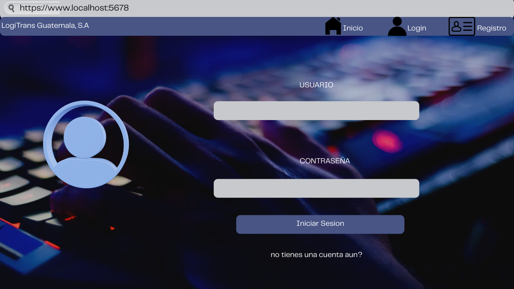
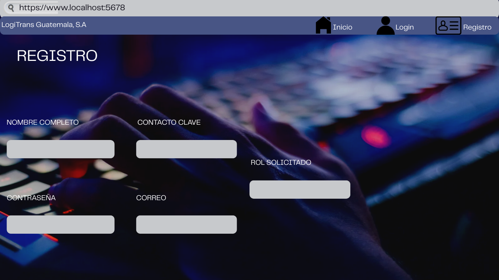
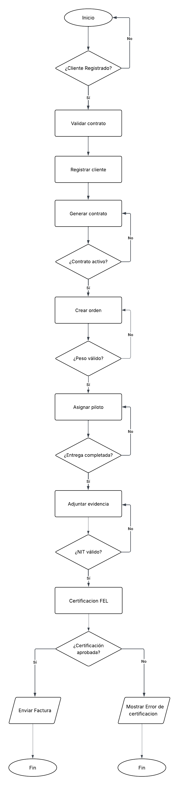

# Prototipo Arquitectónico

## 1. Mockups 

1. Login del sistema

2. Apartado de registro

3. Panel de cliente

4. Panel de agente

5. Panel de administrador

6. Panel de piloto

7. Panel de Contabilidad

8. Panel de gerencia

9. Panel de Supervisor Operativo

## 2. Diagramas de Flujo

### 2.1 Diagrama General del fljo del sistema

### 2.2 Diagrama de Gestion de usuarios

### 2.3 Diagrama de Registro de pagos

### 2.4 Diagrama de Reportes

### 2.5 Diagrama de Facturacion electronica

### 2.6 Diagrama de validacion de credito

### 2.7 Diagrama de ordenes de servicio

