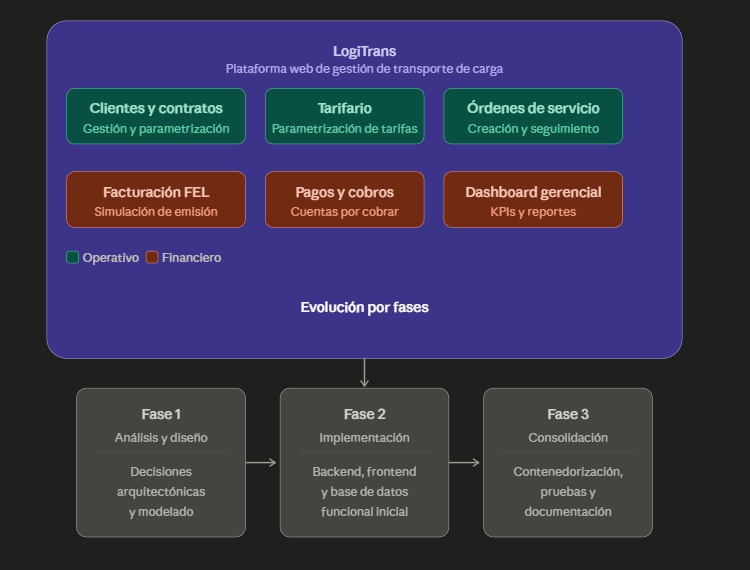
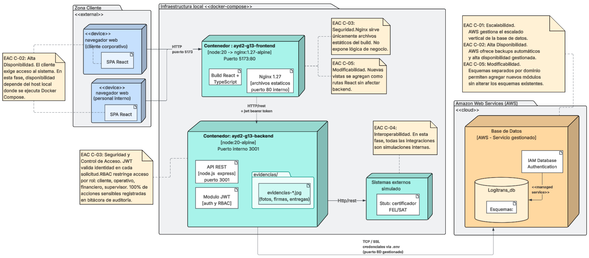
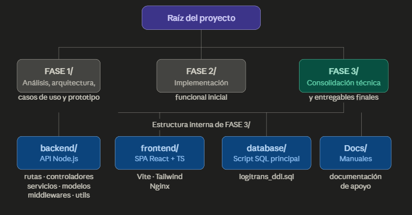
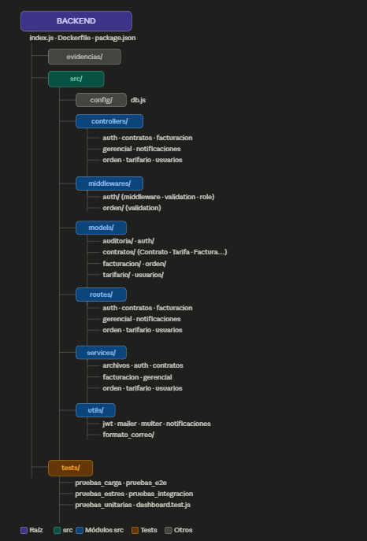
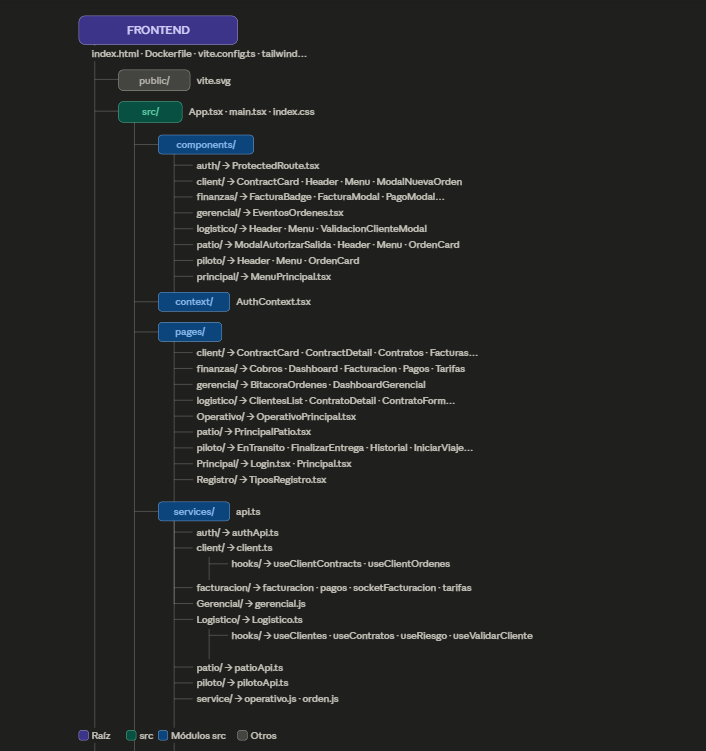

# Manual Tecnico - LogiTrans Guatemala, S.A.

Sistema: LogiTrans Guatemala, S.A.

## Grupo 13
- Giovanni Saul Concoha Cax - 202100229
- Estiben Yair Lopez Leveron - 202204578
- Evelio Marcos Josue Cruz Soliz - 202010040
- Johan Moises Cardona Rosales - 202201405
- Gonzalo Fernando Perez Cazun - 202211515
- Jens Jeremy Pablo Sosof - 202102771

---

## 1. Control de Versiones
| | Fecha | Autor | Descripcion del cambio |
|---|---|---|---|
| | 17/04/2026 | Grupo 13 | FASE 3 |

## 2. Introduccion
Este manual tecnico documenta la implementacion real del proyecto LogiTrans en FASE 3, incluyendo arquitectura, stack tecnologico, estructura del repositorio, configuracion, despliegue, pruebas, lineamientos de ramas y solucion de problemas.

Su objetivo es facilitar mantenimiento, evolucion y puesta en marcha del sistema en un entorno reproducible.

Vista general del sistema.
![\[Insertar imagen aqui\]](image-3.png)


## 3. Alcance Técnico
El alcance tecnico cubre:
- Gestion de usuarios, clientes, contratos y tarifarios.
- Registro y seguimiento de ordenes de servicio.
- Facturacion FEL simulada, pagos y cuentas por cobrar.
- Notificaciones por correo y eventos en tiempo real.
- Reporteria gerencial y dashboards.
- Despliegue con contenedores Docker (frontend y backend).

Fuera de alcance en esta version:
- Integraciones productivas con SAT, aduanas y banca.
- Pipeline CI/CD implementado dentro del repositorio.

## 4. Descripcion General del Sistema
LogiTrans es una plataforma web para gestionar el ciclo operativo y financiero del transporte de carga:
- Gestion de clientes y contratos.
- Parametrizacion de tarifas.
- Creacion y seguimiento de ordenes de servicio.
- Facturacion FEL simulada.
- Registro de pagos y cuentas por cobrar.
- Dashboard gerencial con KPIs.

Evolucion por fases:
- FASE 1: analisis, decisiones arquitectonicas y diseno.
- FASE 2: implementacion funcional inicial de backend, frontend y base de datos.
- FASE 3: consolidacion tecnica, contenedorizacion, pruebas y documentacion.



## 5. Tecnologias Utilizadas
### 5.1 Frontend
- React 19
- TypeScript
- Vite 8
- Tailwind CSS
- Socket.IO Client

### 5.2 Backend
- Node.js
- Express
- Socket.IO
- mssql
- jsonwebtoken (JWT)
- Nodemailer
- Multer

### 5.3 Base de Datos
- SQL Server

### 5.4 Herramientas de despliegue y versionado
- Docker
- Docker Compose
- Git
- AWS

## 6. Arquitectura del Sistema
### 6.1 Vision arquitectonica
Arquitectura web desacoplada de tres capas:
- Presentacion: SPA en React.
- Logica de negocio: API REST en Node.js/Express.
- Persistencia: SQL Server.

Comunicacion:
- REST bajo prefijo /api.
- Eventos en tiempo real con Socket.IO.

### 6.2 Implementacion tecnica en FASE 3
- Frontend servido por Nginx en contenedor Docker.
- Backend ejecutado en contenedor Node.js.
- Frontend hace proxy de /api hacia backend:3001 en red interna Docker.
- El archivo docker-compose.yml define backend y frontend, pero no servicio de base de datos.



## 7. Estructura del Repositorio
Raiz del proyecto:
- FASE 1/: documentacion de analisis, arquitectura, casos de uso y prototipo.
- FASE 2/: implementacion funcional inicial.
- FASE 3/: consolidacion tecnica y entregables finales.

Estructura relevante en FASE 3:
- backend/: API, rutas, controladores, servicios, modelos, middlewares y utilidades.
- frontend/: SPA React + TypeScript + configuracion Vite + Nginx.
- database/: script SQL principal (logitrans_ddl.sql).
- Documentation/: manuales y documentacion de apoyo.



## 8. Diseño Tecnico del Backend
Arquitectura por capas en backend/src:
- routes/: definicion de endpoints por dominio.
- controllers/: manejo de request/response.
- services/: logica de negocio.
- models/: acceso a datos.
- middlewares/: autenticacion, autorizacion y validaciones.
- config/ y utils/: conexion DB, JWT, correo y utilitarios.

Dominios principales implementados:
- auth
- usuarios
- contratos
- orden
- facturacion
- tarifario
- gerencial
- notificaciones




## 9. Diseño Tecnico del Frontend
El frontend organiza modulos por rol y area de negocio en src/pages, con proteccion de rutas para secciones privadas.

Roles implementados en interfaz:
- Cliente
- Operativo
- Logistico
- Finanzas
- Gerencia
- Piloto
- Patio

Listas y vistas destacadas:
- Lista de contratos.
- Lista de clientes.
- Lista de ordenes.
- Lista de facturas.
- Lista de pagos/cobros.
- Bitacora y seguimiento operativo.

Figura 4. Vista de modulos y navegacion del frontend.



## 10. Requisitos del Entorno
### 10.1 Requisitos minimos recomendados
- Sistema operativo: Windows, Linux o macOS.
- Node.js 20.x.
- npm 10.x.
- Docker y Docker Compose (para despliegue contenedorizado).
- SQL Server accesible por red.

### 10.2 Variables de entorno backend
Base de datos (obligatorias):
- DB_SERVER
- DB_PORT
- DB_USER
- DB_PASSWORD
- DB_NAME

Autenticacion:
- JWT_SECRET
- JWT_EXPIRES_IN (opcional, por defecto 8h)

Correo/notificaciones:
- EMAIL_USER
- EMAIL_PASS
- EMAIL_FROM (opcional)
- NODE_ENV

## 11. Configuracion e Instalacion
### 11.1 Ejecucion local (sin Docker)
1. Backend
```bash
cd "FASE 3/backend"
npm install
npm start
```
Backend por defecto en puerto 3001.

2. Frontend
```bash
cd "FASE 3/frontend"
npm install
npm run dev
```
Frontend en modo desarrollo con Vite.

3. Base de datos
- Ejecutar el script: FASE 3/database/logitrans_ddl.sql
- Verificar conectividad DB_* desde backend.

### 11.2 Ejecucion con Docker Compose
```bash
cd "FASE 3"
docker compose up --build -d
```
Servicios esperados:
- Frontend publicado en host:5173 hacia contenedor:80.
- Backend en red interna del compose (puerto 3001).

Se requiere SQL Server externo, ya que docker-compose.yml no define servicio de base de datos.

## 12. API y Seguridad
### 12.1 Convenciones API
- Prefijo base: /api
- Respuestas JSON
- Rutas protegidas por token Bearer

### 12.2 Seguridad implementada
- Autenticacion por JWT.
- Autorizacion por rol mediante middlewares.
- Validaciones de negocio en middlewares y servicios.

### 12.3 Recomendaciones para produccion
- Definir JWT_SECRET robusto.
- Restringir CORS a dominios permitidos.
- Externalizar y proteger secretos.
- Usar HTTPS en punto de entrada.

## 13. Pruebas
Evidencias identificadas en FASE 3:
- backend/tests/dashboard.service.test.js
- backend/tests/pruebas_unitarias/
- backend/tests/pruebas_integracion/
- backend/tests/pruebas_e2e/
- backend/tests/pruebas_carga/
- backend/tests/pruebas_estres/

## 14. CI/CD y Estrategia de Ramas
### 14.1 Estado actual.

### 14.2 Pipeline recomendado
Flujo minimo sugerido:
1. CI Backend: npm ci, lint, pruebas.
2. CI Frontend: npm ci, build, lint.
3. Build de imagenes Docker.
4. CD: despliegue con compose y pruebas de humo.

### 14.3 Estrategia de ramas recomendada
- main: rama estable.
- develop: integracion.
- feature/<nombre>: funcionalidades.
- release/<version>: estabilizacion.
- hotfix/<nombre>: correcciones urgentes.

Reglas sugeridas:
- Pull Request obligatorio para merge a develop/main.
- Revision de codigo previa.
- Build y pruebas como criterio de aceptacion.

## 15. Infraestructura y Despliegue
Implementacion actual:
- Contenedores separados para frontend y backend.
- Nginx en frontend para contenido estatico y proxy inverso de /api.
- Red privada de Docker Compose para comunicacion entre servicios.

Validaciones operativas:
```bash
cd "FASE 3"
docker compose up --build -d
docker compose ps
curl http://localhost:5173
```

Figura 6. Evidencia de despliegue con Docker Compose.
[Insertar imagen aqui]

## 16. Configuracion del Sistema de Notificaciones
El backend utiliza Nodemailer para envio de correo.

Componentes principales:
- src/utils/mailer.js
- src/utils/notificaciones.js
- src/utils/formato_correo/

Capacidades actuales:
- Notificaciones informativas y de alertas.
- Registro de logs de envio/error.
- Verificacion SMTP en entorno de desarrollo.

## 17. Solucion de Problemas Comunes
### 17.1 Error de conexion a base de datos
Validar:
- Variables DB_SERVER, DB_PORT, DB_USER, DB_PASSWORD, DB_NAME.
- Puerto y firewall en SQL Server.
- Credenciales y permisos.

### 17.2 Frontend no consume API
Validar:
- Contexto de ejecucion (Vite local o Docker/Nginx).
- Proxy /api en frontend/nginx.conf.
- Estado del backend.

### 17.3 Error de JWT o acceso denegado (401/403)
Validar:
- JWT_SECRET.
- Header Authorization: Bearer <token>.
- Rol requerido en middlewares.

### 17.4 Correos no se envian
Validar:
- EMAIL_USER y EMAIL_PASS.
- Politica del proveedor SMTP.
- Conectividad de red hacia SMTP.

### 17.5 Falla de build en frontend
Validar:
- Version de Node y lockfile.
- Dependencias instaladas.
- Errores TypeScript o lint.

## 18. Riesgos y Pendientes Tecnicos
- Formalizar pipeline CI/CD en repositorio.
- Incrementar cobertura de pruebas automatizadas.
- Completar documentacion de pruebas unitarias, integracion y e2e.
- Definir estrategia de observabilidad (logs, metricas, alertas).
- Planificar migracion progresiva a infraestructura cloud administrada.

## 19. Conclusiones Tecnicas
- La solucion de FASE 3 consolida una arquitectura desacoplada y mantenible.
- Docker Compose mejora portabilidad y repetibilidad de despliegue.
- La separacion por capas en backend facilita evolucion funcional.
- Seguridad base implementada con JWT y control de acceso por rol.
- El sistema esta funcional para operacion academica y listo para madurar en calidad operativa con CI/CD y mayor cobertura de pruebas.
