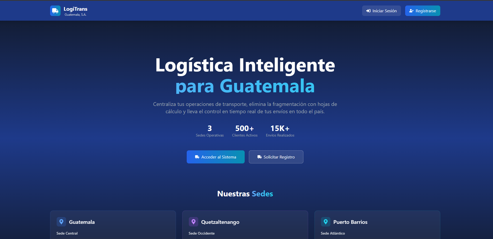
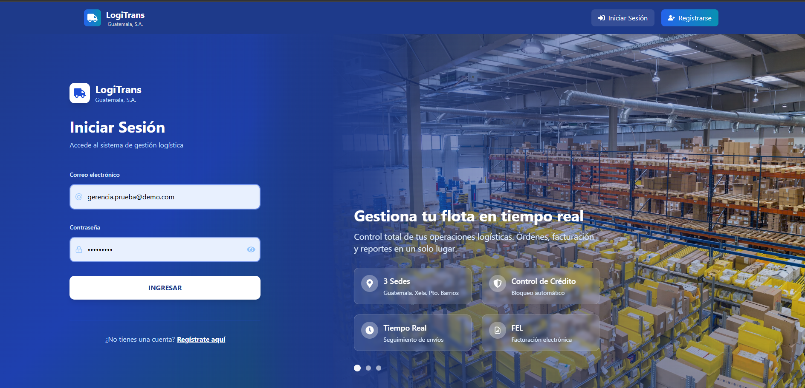
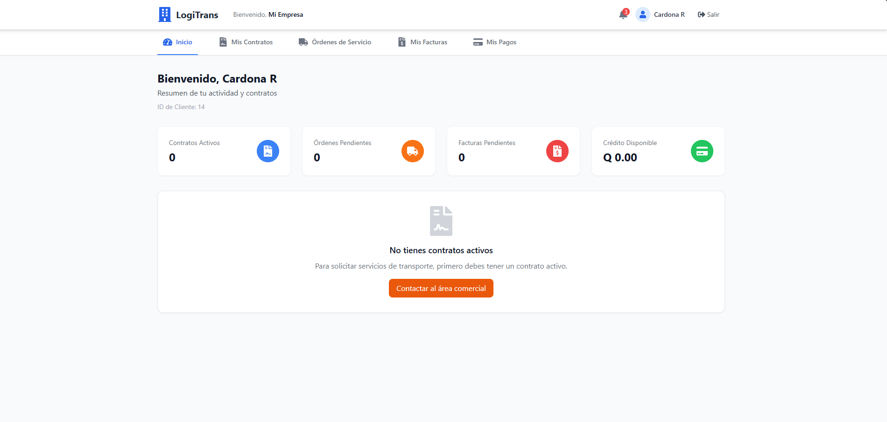
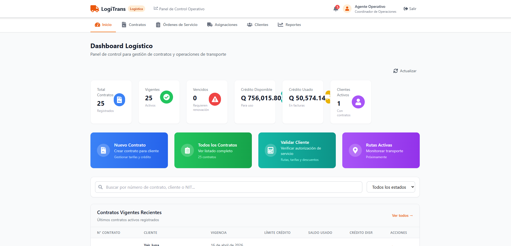
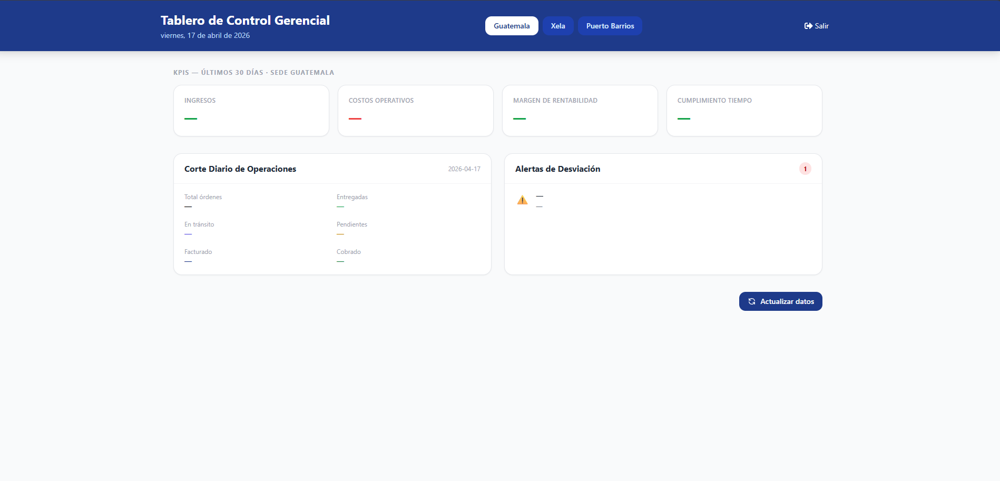
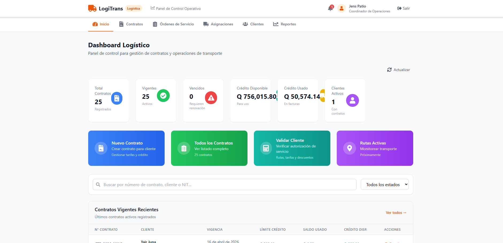

# Manual de Usuario - LogiTrans Guatemala, S.A.

Sistema: LogiTrans Guatemala, S.A.

## GRUPO 13
- Giovanni Saul Concohá Cax 202100229
- Estiben Yair Lopez Leveron 202204578
- Evelio Marcos Josué Cruz Soliz 202010040
- Johan Moises Cardona Rosales 202201405
- Gonzalo Fernando Pérez Cazún 202211515
- Jens Jeremy Pablo Sosof 202102771

---

## 1. Control de Versiones
| Version | Fecha | Autor | Descripcion del cambio |
|---|---|---|---|
| 1.0 | 17/04/2026 | Grupo 13 | Version inicial del manual de usuario |

## 2. Introduccion
### 2.1 Proposito
Este manual tiene como proposito guiar al usuario final en el uso de la plataforma LogiTrans. Describe de forma practica como ingresar al sistema, navegar por los modulos segun el rol, ejecutar las operaciones mas comunes y resolver situaciones frecuentes durante el uso diario.

### 2.2 Publico objetivo
Este documento esta dirigido a los usuarios operativos y administrativos del sistema:
- Clientes corporativos
- Personal operativo y logistico
- Personal de finanzas
- Gerencia
- Pilotos
- Personal de patio

### 2.3 Alcance
El alcance del manual cubre el uso funcional de la plataforma web: acceso, navegacion, operaciones por modulo, validaciones visibles al usuario y recomendaciones para solucionar problemas comunes. No incluye configuracion tecnica interna del servidor, base de datos o despliegue de infraestructura.

## 3. Descripcion General del Sistema
### 3.1 Que es LogiTrans
LogiTrans es una plataforma web para gestionar el ciclo operativo y financiero del transporte de carga en una sola solucion. Permite administrar clientes y contratos, registrar ordenes de servicio, dar seguimiento a la operacion, gestionar facturacion y pagos, y consultar reportes gerenciales para la toma de decisiones.

### 3.2 Beneficios para el usuario
- Centraliza la informacion de clientes, contratos, ordenes y facturacion en un mismo sistema.
- Mejora la trazabilidad de las operaciones mediante estados, bitacoras y evidencias.
- Agiliza procesos administrativos y financieros al reducir tareas manuales y errores de registro.
- Facilita la gestion por roles, mostrando a cada usuario solo los modulos que le corresponden.
- Proporciona visibilidad para seguimiento operativo y analisis gerencial mediante dashboards y reportes.

## 4. Requisitos para el Usuario
### 4.1 Requisitos minimos
- Navegador web actualizado (Google Chrome, Microsoft Edge o Mozilla Firefox).
- Conexion estable a internet o red interna de la organizacion.
- Resolucion recomendada de pantalla: 1366 x 768 o superior.
- Credenciales de acceso activas (usuario/correo y contrasena).

### 4.2 Requisitos de acceso
- Credenciales activas: usuario/correo y contrasena vigentes.
- Rol habilitado: perfil asignado segun funciones (cliente, operativo, finanzas, gerencia, piloto o patio).
- Cuenta habilitada: usuario activo y, si aplica, correo verificado.
- Acceso a la plataforma: URL del sistema disponible y conexion a internet/red interna.
- Sesion valida: inicio de sesion exitoso para acceder a modulos protegidos por permisos.

## 5. Acceso al Sistema
### 5.1 Inicio de sesion

Iniciar sesión es el proceso mediante el cual un usuario accede a un sistema utilizando sus credenciales, generalmente un usuario (o correo electrónico) y una contraseña. El sistema verifica que estos datos sean correctos y, si la validación es exitosa, permite el acceso a la plataforma

### 5.2 Recuperacion de acceso
Si no puede iniciar sesion, utilice la opcion de recuperacion de contrasena disponible en la pantalla de acceso.

Pasos recomendados:
1. Seleccionar la opcion de recuperacion de acceso.
2. Ingresar el correo registrado en el sistema.
3. Revisar el correo y seguir las instrucciones de restablecimiento.
4. Crear una nueva contrasena y volver a iniciar sesion.

Si no recibe el correo o su cuenta no permite recuperacion automatica, contacte al area administradora del sistema.

### 5.3 Cierre de sesion
Para cerrar sesion de forma segura:
1. Haga clic en su perfil o menu de usuario.
2. Seleccione la opcion "Cerrar sesion".
3. Espere la redireccion a la pantalla de inicio de sesion.

Se recomienda cerrar sesion al terminar actividades, especialmente en equipos compartidos.

## 6. Perfiles de Usuario y Permisos
### 6.1 Cliente
Es el panel principal de la plataforma LogiTrans que muestra un resumen de la cuenta del usuario. Incluye el ID de cliente, métricas como contratos activos, órdenes pendientes, facturas pendientes y crédito disponible. También muestra un aviso de que no hay contratos activos y un botón para contactar al área comercial.

### 6.2 Operativo / Logistico
Es el panel de control logístico de la plataforma, donde se muestra un resumen de la gestión de contratos y operaciones de transporte. Incluye métricas como total de contratos, contratos vigentes, vencidos, crédito disponible, crédito usado y clientes activos.

Presenta accesos rápidos para crear un nuevo contrato, ver todos los contratos, validar clientes y monitorear rutas activas. También incluye un buscador de contratos con filtro por estado y una tabla con contratos vigentes recientes, mostrando información como número de contrato, cliente, vigencia, límite de crédito, saldo usado, crédito disponible y acciones.

### 6.3 Finanzas
El perfil de Finanzas permite gestionar informacion economica y de facturacion del cliente.

Funciones frecuentes:
- Consultar facturas emitidas y su estado.
- Validar montos, saldos y documentos pendientes de cobro.
- Registrar pagos y actualizar saldos de clientes.
- Dar seguimiento a operaciones facturadas y pendientes.

### 6.4 Gerencia
Es un tablero de control gerencial que muestra indicadores recientes de desempeño. Incluye secciones de KPIs como ingresos, costos operativos, margen de rentabilidad y cumplimiento de tiempo.

Presenta un resumen del corte diario de operaciones con categorías como total de órdenes, en tránsito, facturado, entregadas, pendientes y cobrado. También muestra un panel de alertas de desviación y un botón para actualizar los datos.

### 6.5 Piloto / Patio
Este perfil concentra la ejecucion operativa en campo y patio para asegurar el cumplimiento de cada orden.

Funciones frecuentes:
- Consultar ordenes asignadas y su estado actual.
- Registrar eventos en bitacora (salida, puntos de control, llegada).
- Actualizar estados operativos segun avance del viaje.
- Registrar evidencias de entrega y observaciones de patio.

## 7. Navegacion de la Plataforma
- Menu principal
- Modulos por rol
- Botones y acciones comunes
- Filtros y busquedas

## 8. Guia de Uso por Modulo
### 8.1 Registro de usuario

Es una pantalla de registro de la plataforma. Muestra un formulario para crear cuenta con campos como NIT, nombres, apellidos, teléfono, correo electrónico, contraseña y confirmación de contraseña, además de un botón de registro.

En la parte superior incluye opciones para iniciar sesión o registrarse, y en el lado izquierdo presenta información general de la plataforma con una imagen de fondo y beneficios del servicio.

### 8.2 Gestion de clientes
Permite consultar, crear y actualizar la información de los clientes, incluyendo sus datos generales, estado y validación dentro del sistema.

### 8.3 Gestion de contratos
Permite crear, revisar y administrar contratos, visualizando su vigencia, estado y condiciones asociadas.

### 8.4 Ordenes de servicio
Permite generar órdenes de servicio, consultar sus estados y dar seguimiento a su ejecución dentro del proceso logístico.

### 8.5 Seguimiento y bitacora
Permite registrar eventos relacionados a las operaciones y consultar el historial de actividades para control y trazabilidad.

### 8.6 Facturacion
Permite visualizar y generar facturas según los permisos del usuario, así como consultar su estado dentro del sistema.

### 8.7 Pagos y cobros
Permite registrar pagos realizados, consultar saldos pendientes y dar seguimiento a la gestión de cobros.

### 8.8 Notificaciones
Permite visualizar alertas y notificaciones del sistema relacionadas con operaciones, contratos y eventos importantes.

### 8.9 Reportes y dashboard
Permite visualizar e interpretar indicadores clave mediante reportes y paneles de control para la toma de decisiones.

## 9. Flujos de Usuario Frecuentes
### 9.1 Flujo: crear orden de servicio
1. Ingresar al modulo de Ordenes de servicio.
2. Seleccionar cliente y contrato vigente.
3. Completar datos de origen, destino, tipo de mercancia y peso estimado.
4. Confirmar la informacion y guardar la orden.
5. Verificar que la orden quede en estado inicial y disponible para seguimiento.

### 9.2 Flujo: seguimiento de orden
1. Buscar la orden por numero, cliente o estado.
2. Abrir el detalle para consultar trazabilidad y bitacora.
3. Registrar actualizaciones operativas conforme avance el servicio.
4. Validar cambios de estado hasta entrega final.
5. Confirmar cierre de la orden con evidencia registrada.

### 9.3 Flujo: facturacion y pago
1. Localizar ordenes entregadas listas para facturacion.
2. Generar factura segun condiciones del contrato y servicio.
3. Validar datos fiscales y emitir documento.
4. Registrar pago recibido (total o parcial).
5. Actualizar estado de cobro y saldo del cliente.

## 10. Mensajes del Sistema y Validaciones
### 10.1 Mensajes de exito
Indican que una acción se realizó correctamente dentro del sistema, como la creación de registros, actualizaciones o procesos completados. Su función es confirmar al usuario que la operación fue exitosa.

### 10.2 Mensajes de advertencia
Alertan sobre situaciones que requieren atención o revisión, pero que no impiden continuar con el proceso. Suelen sugerir acciones recomendadas para evitar posibles inconvenientes.

### 10.3 Mensajes de error
Se muestran cuando ocurre un problema que impide completar una acción. Indican la causa del fallo y orientan al usuario sobre cómo corregirlo o proceder para solucionarlo.

## 11. Solucion de Problemas
### 11.1 No puedo iniciar sesion
Puede deberse a credenciales incorrectas, usuario no registrado o cuenta bloqueada. Verifique usuario y contraseña, revise el uso correcto de mayúsculas/minúsculas y, de ser necesario, utilice la opción de recuperación de contraseña o contacte al administrador.

### 11.2 No veo mi modulo
Puede ocurrir por falta de permisos o roles asignados. Verifique que tenga acceso autorizado y, en caso contrario, solicite habilitación al administrador del sistema.

### 11.3 No carga una pantalla
Puede estar relacionado con problemas de conexión, errores del sistema o carga incompleta. Intente recargar la página, revisar su conexión a internet o cerrar y abrir nuevamente la sesión.

### 11.4 No veo datos esperados
Puede deberse a filtros aplicados, falta de información registrada o permisos limitados. Revise los filtros, confirme que los datos existan en el sistema y valide que tenga acceso a esa información.

